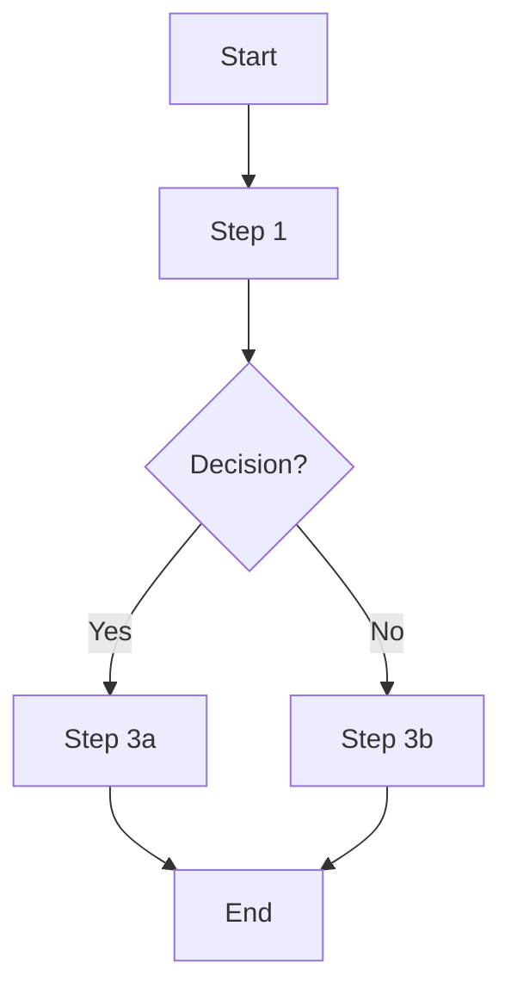

# SOP Template

Standard template for all Avid Analytics playbook deliverables. Used by `/draft-sop` and the `sop-builder` agent.

---

## [Process Name]

**Version:** v1.0
**Last updated:** [Date]
**Author:** [Name]

### Purpose

Why this process exists. What problem it solves. One paragraph max.

### Scope

**In scope:** What this SOP covers.
**Out of scope:** What it explicitly does not cover. Every SOP needs this boundary.

### Prerequisites

What must be true or available before starting:
- [ ] [Tool / access / resource]
- [ ] [Prior step completed]

### Steps

1. **[Action]** — [Clear instruction]
   - Detail or sub-step if needed
2. **[Action]** — [Clear instruction]
3. **Decision point:** If [condition], go to step X. Otherwise continue.
4. **[Action]** — [Clear instruction]

### Flow Diagram

### Escalation

When and how to escalate:
- **Trigger:** [What condition means this needs escalation]
- **Who:** [Person or role]
- **How:** [Channel — email, Slack, phone]

### Metrics

How to measure if this process is working:
- [Metric 1] — [Target]
- [Metric 2] — [Target]

### Automation Candidates

| Step | Score (F x T x E) | Recommendation |
|------|-------------------|----------------|
| [Step N] | [X] | Automate / Simplify / Keep manual |
